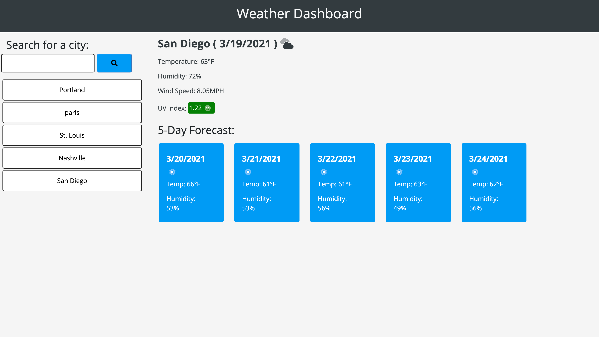

# Weather Dashboard 

## Description
A website to dynamically show the current weather of any chosen city. Any city chosen is saved in a button list under the search bar for access at any point. The search displays the city's name, date and icon representation of weather patterns. It also displays temperature, humidity, wind speed, and UV index. Also the next five day's weather is displayed under the current weather. The five days show the date, weather representation icon, temperature, and humidity.
 

## Built With
* HTML
* CSS
* JavaScript
* Jquery
* Bootstrap
* Open Weather API

## Website

(https://johnbanas.github.io/weather-dashboard/)

### Web Page Image

## Contribution
Made with :heart: by John Patrick Banas
Vanderbilt Full-Stack Web Developer Course

All the different forums and the countless users on them that helped me: 
### GitHub
### StackOverflow
### CodePen
### Codecademy
### Coursera
### Udemy
